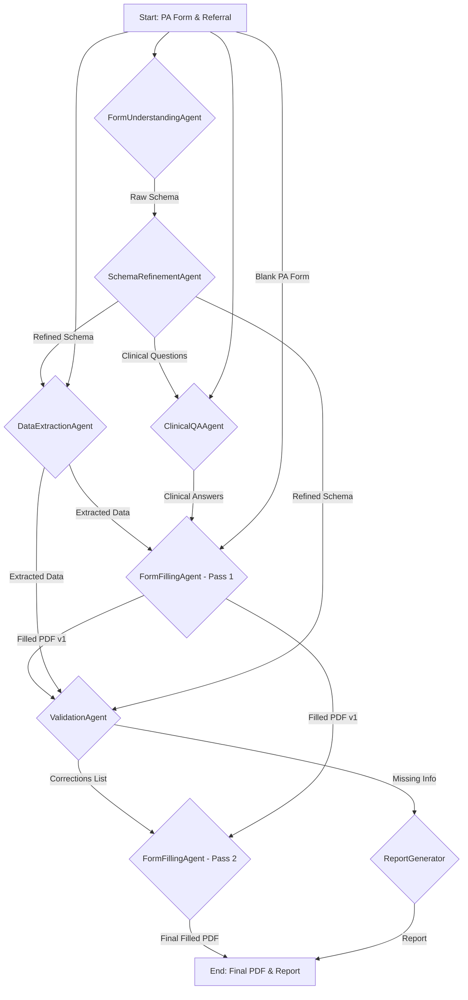

# Mandolin AI: Automated Prior Authorization Filling System

This repository contains an advanced AI pipeline designed to automate the filling of Prior Authorization (PA) forms for specialty drugs, aiming to reduce the manual administrative burden on healthcare providers and accelerate patient access to critical treatments.

## 1. The Problem: The Prior Authorization Bottleneck

Getting approval for life-saving specialty drugs is a complex, manual process that can delay patient care by up to 30 days. Healthcare staff must manually:
1.  Analyze a patient's **Referral Package** (a 30-50 page document with medical history, lab results, etc.).
2.  Find the correct drug- and insurance-specific **PA Form**.
3.  Painstakingly extract key data points from the referral.
4.  Manually transcribe that data onto the PA form.

This workflow is slow and prone to human error, creating a significant bottleneck. This project's goal is to automate this entire process with a high degree of accuracy and reliability.

## 2. The Solution: A Multi-Agent AI Assembly Line

This system solves the problem by breaking it down into a sequence of specialized tasks, each handled by a dedicated AI agent. This "AI Assembly Line" approach ensures each step is simple, reliable, and auditable, leading to a more robust and accurate system than a single monolithic model.

### Architectural Diagram



### The Agents

-   **`FormUnderstandingAgent` (The Blueprint Maker):** Uses `gemini-2.0-flash` to visually analyze the blank PA form, identifying every field and its human-readable text label.
-   **`SchemaRefinementAgent` (The Translator):** Uses a powerful LLM (`gemini-1.5-pro-latest`) to translate human labels (e.g., "Patient First Name") into standardized, machine-readable keys (e.g., `patient_first_name`). This is a critical step for generalization.
-   **`DataExtractionAgent` (The Detective):** Uses `gemini-2.5-pro` to read the entire referral package, using the refined schema as a "shopping list" to find the required data.
-   **`ClinicalQAAgent` (The Specialist):** A specialized `gemini-2.5-pro` agent that focuses only on answering the complex "Yes/No" clinical questions on the form.
-   **`FormFillingAgent` (The Scribe):** A non-AI agent that mechanically fills the PDF form fields using `PyMuPDF`.
-   **`ValidationAgent` (The Auditor):** The system's core "fill and verify" loop. This `gemini-2.5-pro` agent visually inspects the first-pass filled form, compares it to the source data, and generates a list of corrections to fix hallucinations or formatting errors.

## 3. Installation

To set up the project locally, follow these steps.

**Prerequisites:**
- Python 3.9+
- An API key for Google's Gemini models.

**Setup:**

1.  **Clone the repository:**
    ```bash
    git clone https://github.com/alhridoy/automate_pa.git
    cd headstarter-mandolin-project
    ```

2.  **Install dependencies:**
    ```bash
    pip install -r requirements.txt
    ```

3.  **Configure your environment:**
    -   Create a file named `.env` in the project root.
    -   Add your Google Gemini API key to this file:
        ```
        GEMINI_API_KEY="YOUR_API_KEY_HERE"
        ```

## 4. How to Run the Pipeline

Execute the main script from the project's root directory:

```bash
python3 MANDOLIN_PA_SYSTEM.py
```

The script will automatically find the patient data in the `Input Data/` directory, process each patient one by one, and place the results in the `Output Data/` directory.

The output for each patient will include:
-   `{PatientName}_PA_filled.pdf`: The final, filled PDF.
-   `{PatientName}_processing_report.md`: A report detailing any information that could not be found.
-   Intermediate log files (schemas, extracted data) for debugging.

## 5. Assumptions & Limitations

-   **Widget-Based PDFs:** The system is currently designed to work only with interactive, widget-based PDF forms. It cannot fill "flat" PDFs that do not have fillable AcroForm fields. This was a primary requirement, with flat PDF support noted as a potential bonus feature.
-   **API Access & Cost:** The system relies on powerful, and therefore not free, LLMs. Execution will incur costs based on token usage. The system also assumes that the specified models (`gemini-2.0-flash`, `gemini-1.5-pro-latest`, `gemini-2.5-pro`) are available to the provided API key.
-   **Fax Quality:** The accuracy of the OCR-dependent steps (`DataExtractionAgent`, `ClinicalQAAgent`) is highly dependent on the image quality of the scanned documents in the referral package. Extremely poor handwriting or low-quality scans may reduce accuracy.
-   **No Hallucination Guarantee:** While the `ValidationAgent` significantly mitigates the risk of AI hallucinations, it is not a perfect guarantee. It represents a robust best-effort attempt to catch and correct errors. 